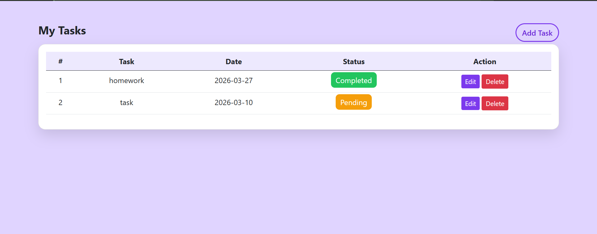

# Task Manager (Laravel)

## Overview
A web-based task management application built using Laravel. This project allows users to create, update, and manage tasks efficiently with a structured backend and database integration.

## Features
- Add, edit, and delete tasks  
- Mark tasks as completed  
- Dynamic task management  
- Database integration using MySQL  
- Clean MVC architecture  

## Tech Stack
- PHP (Laravel)  
- MySQL  
- HTML, CSS, JavaScript  
- Bootstrap  

## Project Structure
- `app/` – Application logic  
- `routes/` – Web routes  
- `resources/` – Views and frontend  
- `database/` – Migrations / DB files  
- `public/` – Entry point  

## Setup Instructions

1. Clone the repository  

2. Install dependencies:
```
composer install
```

3. Create environment file:
```
copy .env.example .env
```

4. Generate app key:
```
php artisan key:generate
```

5. Import database:
- Use the provided `.sql` file  

6. Run server:
```
php artisan serve
```

7. Open:
```
http://127.0.0.1:8000
```

## Notes
- `vendor/` and `node_modules/` are excluded  
- Requires PHP, Composer, and MySQL

## Screenshot


## Author
Procheta Ray
